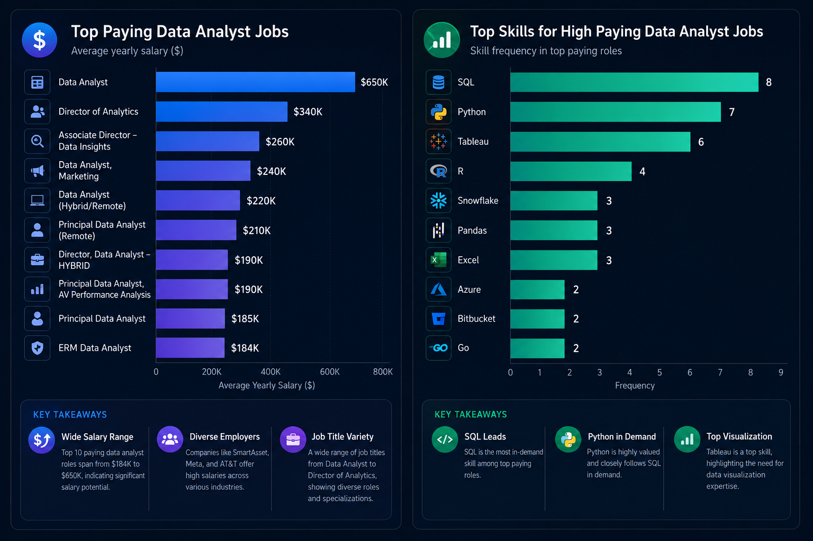

# 📊 SQL Practice Portfolio

This repository contains my SQL practice exercises and projects completed while learning SQL for Data Analytics.

## 📚 Topics Covered
- SELECT & WHERE
- ORDER BY
- GROUP BY
- Aggregate Functions
- CASE Statements
- JOINS
- Subqueries
- Common Table Expressions (CTEs)
- Data Analysis Queries

## 🗂️ Database
The exercises use a job postings dataset, including:
- `job_postings_fact`
- `company_dim`
- `skills_dim`
- `skills_job_dim`

## 🔍 The Analysis

Here's the breakdown of the top data analyst jobs:

- **Wide Salary Range:** Top 10 paying data analyst roles span from $184,000 to $650,000, indicating significant salary potential in the field.
- **Diverse Employers:** Companies like SmartAsset, Meta, and AT&T are among those offering high salaries, showing a broad interest across different industries.
- **Job Title Variety:** There's a high diversity in job titles, from Data Analyst to Director of Analytics, reflecting varied roles and specializations within data analytics.

*Visualization showing the top-paying Data Analyst jobs and the most frequently required skills for those roles, generated using ChatGPT based on my SQL query results.*

## 🎯 Goal
To strengthen my SQL skills by solving real-world data analysis problems and preparing for Data Analyst roles.

## 🛠️ SQL Concepts Practiced
- Filtering and sorting data
- Data aggregation
- Table joins
- Conditional logic
- Subqueries
- CTEs
- Query optimization

---
⭐ This repository documents my SQL learning journey and progress.
